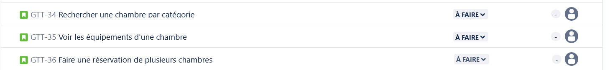

# Gérer un projet SCRUM

---

## Modalités

1. En binôme
2. Créez un projet SCRUM sur Jira
3. Reprendre les tickets du product backlog ci-après
4. Versionez votre code
5. Présentation d'un ou plusieurs incréments opérationnels l'après-midi du dernier jour de la formation lors de la Sprint Review.
6. Définissez votre ou vos objectifs de sprint à chaque fois sur Jira
7. N'oubliez pas d'apporter de la valeur et la notion du MVP
8. Respectez la Definition Of Done ci-dessous

---

## Definition of Done

---

## Product Backlog

Le Product Owner a constitué le Product Backlog ci-après.
Ce Product Backlog comme nous l'avons vu dans le cours sur la gestion de projet peut évoluer. Libre à vous de partir de cette base et d'en faire ce que vous voulez pour définir un objectif de Sprint. Autrement dit, vous pouvez ajouter/modifier/supprimer des éléments.

---

---

---

---

---

## Expression des besoins initiale

